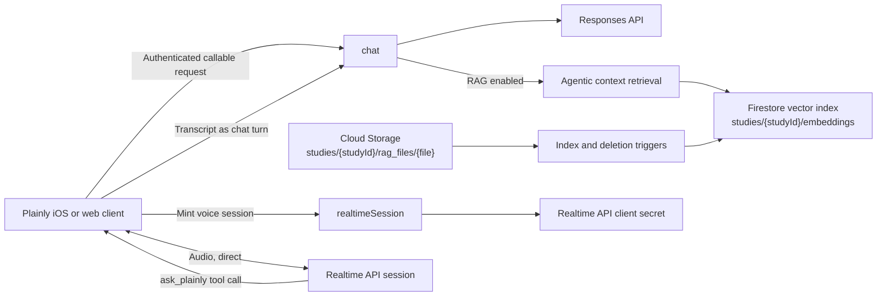

<!--

This source file is part of the Plainly Firebase open-source project

SPDX-FileCopyrightText: 2026 Stanford University and the project authors (see CONTRIBUTORS.md)

SPDX-License-Identifier: MIT

-->

# Plainly Firebase

[](https://github.com/SchmiedmayerLab/Plainly-Firebase/actions/workflows/build-and-test.yml)
[](https://github.com/SchmiedmayerLab/Plainly-Firebase/actions/workflows/deployment.yml)
[](https://github.com/SchmiedmayerLab/Plainly-Firebase/actions/workflows/codeql.yml)
[](https://api.reuse.software/info/github.com/SchmiedmayerLab/Plainly-Firebase)
[](LICENSE.md)

Firebase cloud infrastructure for [Plainly](https://github.com/SchmiedmayerLab/Plainly-iOS), an experimental iOS app for a consented Stanford research study. The study evaluates whether conversational artificial intelligence can help participants understand FHIR-formatted health records and navigate the healthcare system.

This repository provides an authenticated chat service, study-specific retrieval-augmented generation (RAG), document indexing, and a lightweight web client for local comparison testing.

> [!IMPORTANT]
> The production service is only for invited participants who have completed the study consent process. Plainly does not provide medical advice, diagnosis, or treatment. The signed consent form, HIPAA authorization, and other study information govern participation and the handling of participant information.

## Repository Overview

The backend includes:

- An authenticated Firebase callable function that accepts OpenAI Responses API payloads.
- A callable that mints short-lived credentials for OpenAI Realtime API voice sessions layered on that chat.
- Optional RAG using study-specific documents and Firestore vector search.
- Storage triggers that index uploaded PDF, plain-text, and Markdown documents.
- Automatic removal of indexed context when a source document is deleted.
- A local React web client for comparing responses with and without RAG.

## Architecture



The `chat` function requires Firebase authentication and a `studyId` query parameter. Set `ragEnabled=true` to retrieve study-specific context before generating a response. Streaming and non-streaming Responses API payloads are supported. If the Stanford gateway rejects streaming with HTTP 500 before emitting any event, the backend retries the same intercepted request once without streaming and adapts the result into canonical Responses events. It never replays a request after the gateway has emitted a response identifier or other event.

The endpoint accepts only Plainly's configured model identifiers and client-side function tools. A request with `generatesImages=true` may also offer the hosted image generation tool, which the app sends only for a study that enables it. Other server-executed tools, background jobs, conversations, file inputs, and remote images are rejected. The app disables participant attachments, while the endpoint retains a bounded inline JPEG/PNG path for study-authored image questionnaires. The backend enforces stored response state because clients use `previous_response_id` for multi-turn conversations. Before any response identifier is returned, its SHA-256 digest is bound to the authenticated Firebase user and study in a server-only Firestore collection. Unknown, expired, cross-user, and cross-study continuations are rejected, and the ownership records expire after 30 days.

### Voice Sessions

The `realtimeSession` function mints an ephemeral OpenAI Realtime API client secret for an authenticated participant and study. The session is configured server-side: the realtime model gets a single `ask_plainly` tool and a required tool choice, so every participant turn is handed to the client, which forwards the transcript to `chat` as an ordinary text turn and returns the answer for the model to read aloud. The realtime model never answers a question itself: its only words of its own are short acknowledgements while an answer is on its way, and the Responses chain stays the conversation of record. A client may choose the realtime model from a separate allowlist, the instructions, the voice, and the transcription language. Turn detection is semantic and does not let the participant interrupt an answer, so a device without echo cancellation cannot talk over itself. Secrets expire after two minutes and only gate opening a session; the session itself is bounded by the provider. Each participant may start ten sessions per hour, tracked in a server-only Firestore collection whose documents expire with their window; a session whose secret could not be minted does not count.

The configuration is a default, not a lock: the Realtime API lets the holder of a client secret change everything but the model over the session, and the client itself lifts the tool choice for each spoken reply. What bounds misuse of a leaked secret is the model allowlist, the hourly allowance, the provider's session cap, and spend alerts on the key. The app signs participants in anonymously, so a caller who creates fresh accounts is not bound by the per-user allowance; App Check on the callable is what closes that.

Audio never passes through Firebase. Besides audio, that endpoint receives the session instructions, which carry the study prompt and, when a participant switches from typing to talking, the last few exchanges of the text chat, as well as every answer the client reads back; point it only at an endpoint approved for that data. The iOS app opens the `/v1/realtime` WebSocket at the endpoint the secret was minted for, which is `OPENAI_REALTIME_BASE_URL`, or `OPENAI_BASE_URL` while no realtime key is set, so a gateway there has to proxy the `/v1/realtime/client_secrets` call and that WebSocket, and the key has to be enabled for a realtime model and a transcription model. The web client uses WebRTC instead: it posts its offer to `/v1/realtime/calls` and the media then flows to the provider's media servers directly, which a gateway cannot carry. Nothing in the realtime path is a `previous_response_id` continuation, so the ownership checks above do not apply to it.

Stored provider responses may have their own retention period. Each deployment must verify that the gateway's response-retention and deletion policies match the approved consent, study protocol, and Stanford data-handling requirements before launch.

Documents uploaded to `studies/{studyId}/rag_files/{file}` are extracted, chunked, embedded, and stored in `studies/{studyId}/embeddings`. Supported content types are PDF, plain text, and Markdown. Deleting a source document removes its indexed chunks.

## Development

### Requirements

- [Node.js 24](https://nodejs.org/)
- [Firebase CLI](https://firebase.google.com/docs/cli)
- A Firebase project with Authentication, Functions, Firestore, and Storage
- An OpenAI-compatible API key

### Configure Local Secrets

Create the local Functions secret file from the provided example:

```bash
cp functions/.secret.local.example functions/.secret.local
```

Replace the placeholders in `functions/.secret.local` with a development `OPENAI_API_KEY` and the `OPENAI_BASE_URL` that key belongs to. Leave `OPENAI_REALTIME_API_KEY` empty to mint voice sessions with the same pair, or set it together with its `OPENAI_REALTIME_BASE_URL`. Both are secrets, so neither has a value until you set one: a missing base URL leaves the OpenAI SDK on its own default endpoint, where a gateway key is rejected as unauthenticated. Never commit this file.

### Run the Backend

Install the dependencies and start the Authentication, Functions, and Firestore emulators:

```bash
npm --prefix functions install
sh run-emulator.sh
```

To include the Storage emulator for document-indexing work, run:

```bash
npm --prefix functions run build
firebase emulators:start --only auth,functions,firestore,storage
```

For deterministic client end-to-end tests, set `PLAINLY_MOCK_CHAT_RESPONSE`
before starting the emulator. The Functions emulator then returns that text as
an OpenAI-compatible response without making an external API request. This
override is ignored outside the Firebase emulator.

### Run the Web Client

In a separate terminal:

```bash
npm --prefix web install
npm --prefix web run dev
```

The web client connects to the local Authentication and Functions emulators and uses mock FHIR tool responses. Its default study identifier is `edu.stanford.plainly.spineAI`, and its default model is `gpt-5.5`.

The voice panel starts a Realtime API session over WebRTC in the browser and forwards every turn through the RAG-enabled chat. It needs the emulator running with a real key that can reach a realtime model; under `PLAINLY_MOCK_CHAT_RESPONSE` the minted secret is a stand-in the provider rejects. Without a microphone a turn can be typed instead. Sessions cost audio tokens, so keep them short.

### Validate Changes

```bash
npm --prefix functions run build
npm --prefix functions run lint
npm --prefix functions run test:coverage
firebase emulators:exec --project demo-plainly --only auth,functions,firestore,storage \
  "npm --prefix functions run test:integration"
npm --prefix web run build
npm --prefix web test
npm --prefix web run lint
```

## Configuration

| Name | Location | Purpose |
| --- | --- | --- |
| `OPENAI_API_KEY` | Firebase Functions secret | Generates model responses and document embeddings. |
| `OPENAI_BASE_URL` | Firebase Functions secret | Selects the OpenAI-compatible API endpoint, for example `https://aiapi-prod.stanford.edu/v1`. |
| `OPENAI_REALTIME_API_KEY` | Firebase Functions secret | Mints voice sessions when set; empty shares `OPENAI_API_KEY`. |
| `OPENAI_REALTIME_BASE_URL` | Firebase Functions secret | The endpoint voice sessions are minted for and stream to, for example `https://api.openai.com/v1`; empty shares `OPENAI_BASE_URL`. |
| `OPENAI_RESPONSES_STREAMING_SUPPORTED` | Functions environment | Defaults to trying streaming and falling back when the gateway rejects it before emitting an event. Set to `false` to skip the probe and synthesize events directly from a non-streaming response. |
| `FIREBASE_PROJECT_ID` | GitHub environment variable | Selects the Firebase project used by deployment workflows. |
| `GOOGLE_APPLICATION_CREDENTIALS_BASE64` | GitHub environment secret | Authenticates automated Firebase deployments. |
| `STORAGE_BUCKET` | Functions environment | Overrides the default `<project>.firebasestorage.app` bucket. |
| `STORAGE_REGION` | Functions environment | Overrides the default `us-central1` Storage trigger region. |
| `VERBOSE_LOGGING` | Functions environment | Enables detailed request and retrieval logging when set to `true`. |
| `VITE_STUDY_ID` | Web environment | Overrides the web client's default study identifier. |
| `VITE_LLM_MODEL` | Web environment | Overrides the web client's default `gpt-5.5` model. The value must also be enabled by the Functions allowlist. |

The voice layer shares `OPENAI_API_KEY` and `OPENAI_BASE_URL` until `OPENAI_REALTIME_API_KEY` is set, at which point voice sessions are minted with the realtime pair while chat stays where it is. Whichever key mints them must be enabled for a realtime model such as `gpt-realtime-mini` and for `gpt-4o-mini-transcribe`, and its endpoint must serve the realtime paths; clients stream audio to the endpoint the session was minted for. A realtime key without its base URL is refused rather than sent to the SDK's default endpoint. All four secrets must exist before a deployment; set the realtime key to an empty value to share the chat pair.

Configure the secrets with:

```bash
firebase functions:secrets:set OPENAI_API_KEY
firebase functions:secrets:set OPENAI_BASE_URL
firebase functions:secrets:set OPENAI_REALTIME_API_KEY
firebase functions:secrets:set OPENAI_REALTIME_BASE_URL
```

The deployment workflow validates the project before deploying. Pushes to `main` deploy to the staging environment; configured environments can also be selected through a manual workflow run.

## Project Structure

| Path | Purpose |
| --- | --- |
| [`functions/src/functions`](functions/src/functions) | Callable chat and realtime session functions and Storage triggers. |
| [`functions/src/services`](functions/src/services) | Chat, realtime session, extraction, chunking, embedding, indexing, and context services. |
| [`web`](web) | Optional React comparison client for local development. |
| [`firestore.rules`](firestore.rules) | Firestore access rules. |
| [`storage.rules`](storage.rules) | Cloud Storage access rules. |
| [`.github/workflows`](.github/workflows) | Build, security analysis, link checking, and deployment automation. |

## Contributing

Contributions to this project are welcome. Please make sure to read the [contribution guidelines](https://github.com/SchmiedmayerLab/.github/blob/main/CONTRIBUTING.md) and the [contributor covenant code of conduct](https://github.com/SchmiedmayerLab/.github/blob/main/CODE_OF_CONDUCT.md) first. You can find a list of contributors in the [CONTRIBUTORS.md](CONTRIBUTORS.md) file.

## License

This project is licensed under the MIT License. See [LICENSE.md](LICENSE.md) for more information.

## Citation

If you use this software, please cite it using the metadata in [CITATION.cff](CITATION.cff), which GitHub surfaces through the [*Cite this repository*](https://docs.github.com/en/repositories/managing-your-repositorys-settings-and-features/customizing-your-repository/about-citation-files) button.

## Our Research

For more information, visit the [Schmiedmayer Lab GitHub organization](https://github.com/SchmiedmayerLab).


