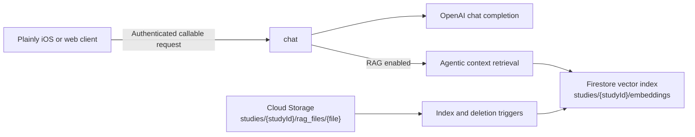

<!--

This source file is part of the Plainly Firebase open-source project

SPDX-FileCopyrightText: 2026 Stanford University and the project authors (see CONTRIBUTORS.md)

SPDX-License-Identifier: MIT

-->

# Plainly Firebase

[](https://github.com/SchmiedmayerLab/Plainly-Firebase/actions/workflows/build-and-test.yml)
[](https://github.com/SchmiedmayerLab/Plainly-Firebase/actions/workflows/codeql.yml)
[](https://github.com/SchmiedmayerLab/Plainly-Firebase/actions/workflows/deployment.yml)

Firebase cloud infrastructure for [Plainly](https://github.com/SchmiedmayerLab/Plainly-iOS), an experimental iOS app for a consented Stanford research study. The study evaluates whether conversational artificial intelligence can help participants understand FHIR-formatted health records and navigate the healthcare system.

This repository provides an authenticated chat service, study-specific retrieval-augmented generation (RAG), document indexing, and a lightweight web client for local comparison testing.

> [!IMPORTANT]
> The production service is only for invited participants who have completed the study consent process. Plainly does not provide medical advice, diagnosis, or treatment. The signed consent form, HIPAA authorization, and other study information govern participation and the handling of participant information.

## Repository Overview

The backend includes:

- An authenticated Firebase callable function that accepts OpenAI chat-completion payloads.
- Optional RAG using study-specific documents and Firestore vector search.
- Storage triggers that index uploaded PDF, plain-text, and Markdown documents.
- Automatic removal of indexed context when a source document is deleted.
- A local React web client for comparing responses with and without RAG.

## Architecture



The `chat` function requires Firebase authentication and a `studyId` query parameter. Set `ragEnabled=true` to retrieve study-specific context before generating a response. Streaming and non-streaming chat-completion payloads are supported.

Documents uploaded to `studies/{studyId}/rag_files/{file}` are extracted, chunked, embedded, and stored in `studies/{studyId}/embeddings`. Supported content types are PDF, plain text, and Markdown. Deleting a source document removes its indexed chunks.

## Development

### Requirements

- [Node.js 24](https://nodejs.org/)
- [Firebase CLI](https://firebase.google.com/docs/cli)
- A Firebase project with Authentication, Functions, Firestore, and Storage
- An OpenAI API key

### Configure Local Secrets

Create the local Functions secret file from the provided example:

```bash
cp functions/.secret.local.example functions/.secret.local
```

Replace the placeholder in `functions/.secret.local` with a development `OPENAI_API_KEY`. Never commit this file.

### Run the Backend

Install the dependencies and start the Authentication and Functions emulators:

```bash
npm --prefix functions install
sh run-emulator.sh
```

To include the Storage emulator for document-indexing work, run:

```bash
npm --prefix functions run build
firebase emulators:start --only auth,functions,storage
```

For deterministic client end-to-end tests, set `PLAINLY_MOCK_CHAT_RESPONSE`
before starting the emulator. The Functions emulator then returns that text as
an OpenAI-compatible completion without making an external API request. This
override is ignored outside the Firebase emulator.

### Run the Web Client

In a separate terminal:

```bash
npm --prefix web install
npm --prefix web run dev
```

The web client connects to the local Authentication and Functions emulators and uses mock FHIR tool responses. Its default study identifier is `edu.stanford.plainly.spineAI`.

### Validate Changes

```bash
npm --prefix functions run build
npm --prefix functions run lint
npm --prefix functions run test:coverage
firebase emulators:exec --project demo-plainly --only auth,functions,firestore,storage \
  "npm --prefix functions run test:integration"
npm --prefix web run build
npm --prefix web run lint
```

## Configuration

| Name | Location | Purpose |
| --- | --- | --- |
| `OPENAI_API_KEY` | Firebase Functions secret | Generates chat completions and document embeddings. |
| `FIREBASE_PROJECT_ID` | GitHub environment variable | Selects the Firebase project used by deployment workflows. |
| `GOOGLE_APPLICATION_CREDENTIALS_BASE64` | GitHub environment secret | Authenticates automated Firebase deployments. |
| `STORAGE_BUCKET` | Functions environment | Overrides the default `<project>.firebasestorage.app` bucket. |
| `STORAGE_REGION` | Functions environment | Overrides the default `us-central1` Storage trigger region. |
| `VERBOSE_LOGGING` | Functions environment | Enables detailed request and retrieval logging when set to `true`. |
| `VITE_STUDY_ID` | Web environment | Overrides the web client's default study identifier. |

Configure the production API key with:

```bash
firebase functions:secrets:set OPENAI_API_KEY
```

The deployment workflow validates the project before deploying. Pushes to `main` deploy to the staging environment; configured environments can also be selected through a manual workflow run.

## Project Structure

| Path | Purpose |
| --- | --- |
| [`functions/src/functions`](functions/src/functions) | Callable chat function and Storage triggers. |
| [`functions/src/services`](functions/src/services) | Chat, extraction, chunking, embedding, indexing, and context services. |
| [`web`](web) | Optional React comparison client for local development. |
| [`firestore.rules`](firestore.rules) | Firestore access rules. |
| [`storage.rules`](storage.rules) | Cloud Storage access rules. |
| [`.github/workflows`](.github/workflows) | Build, security analysis, link checking, and deployment automation. |

## Contributing

Contributions to this project are welcome. Please read the [contribution guidelines](https://github.com/SchmiedmayerLab/.github/blob/main/CONTRIBUTING.md) and the [Contributor Covenant Code of Conduct](https://github.com/SchmiedmayerLab/.github/blob/main/CODE_OF_CONDUCT.md) first.

## License

This project is licensed under the MIT License. See [LICENSE.md](LICENSE.md) for more information.

## Our Research

For more information, visit the [Schmiedmayer Lab GitHub organization](https://github.com/SchmiedmayerLab).


